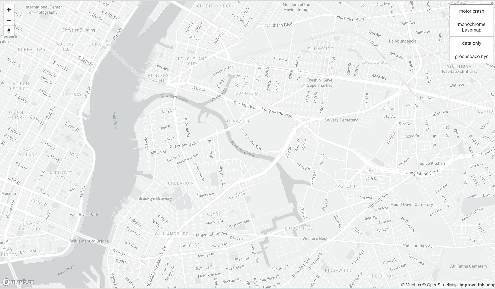
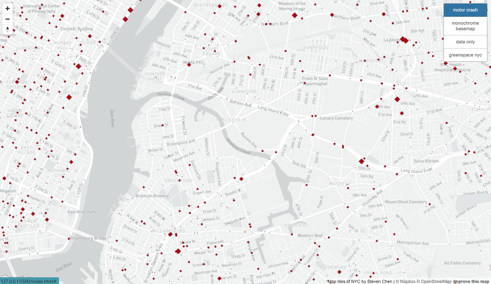
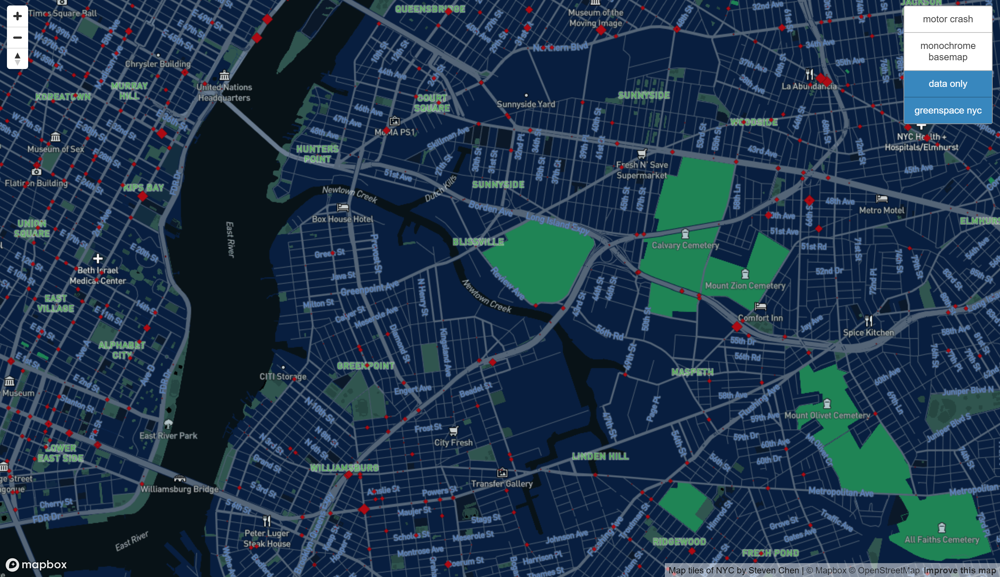
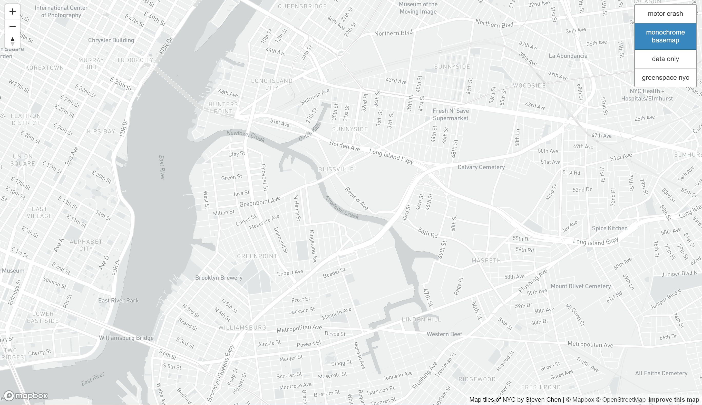

# NYC Map Tiles

## Introduction 
The project generated a web page with mapbox GL JS APIs with map tiles of New York Cities and open data from NYC on motorcycles' crash the number of people who are injured, as well as customized mapbox map style showing greenspace in NYC. The available zoom would be from level of 12 to level of 15. Each of the tile set serves different informative funtionality. Motor crash shows motor crash in April, 2022 and classified by the number of injured people. Monochrome basemap is the default monochrome map from mapbox styles. Greenspace_nyc is the modified map layer showing the green spaces in NYC and the data only are simply the data points of motor crashes without the basemap. 

## Screenshots

